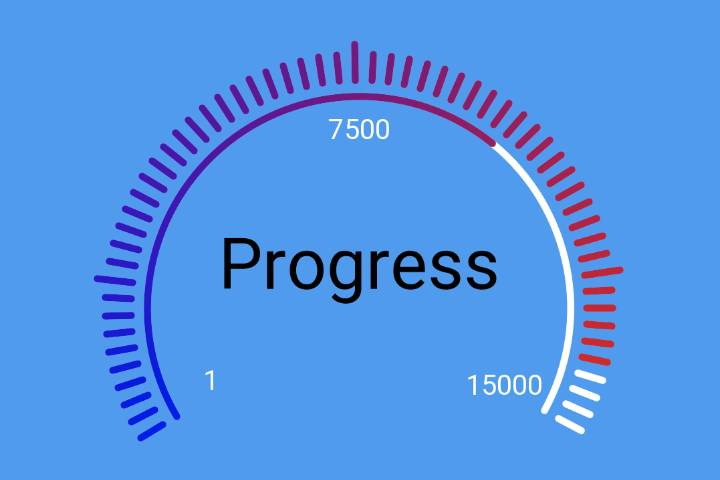
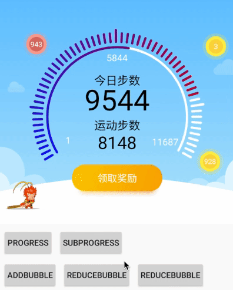

# ArcProgressBar

what we can do...
* a arc progress bar with title, title-desc, sub-title, sub-title-desc
* background with bezier path mask
* two different progress in one view
* bubbles around progress bar
* dynamic control the scale count
* fluent animation

# Quick View

